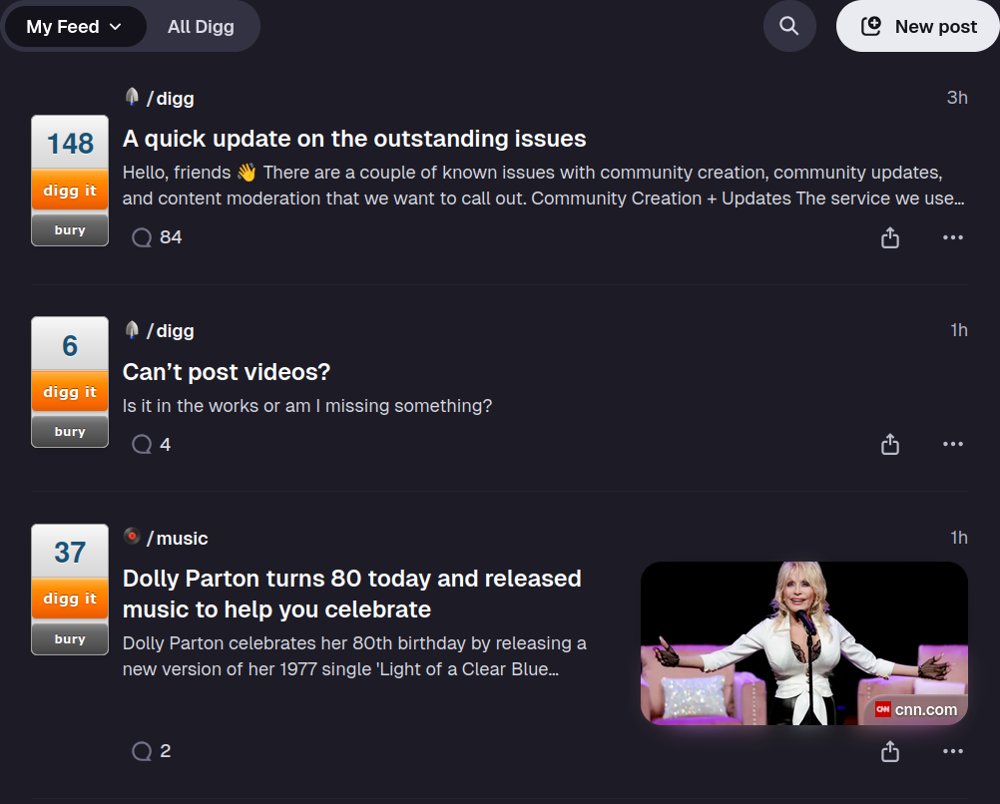
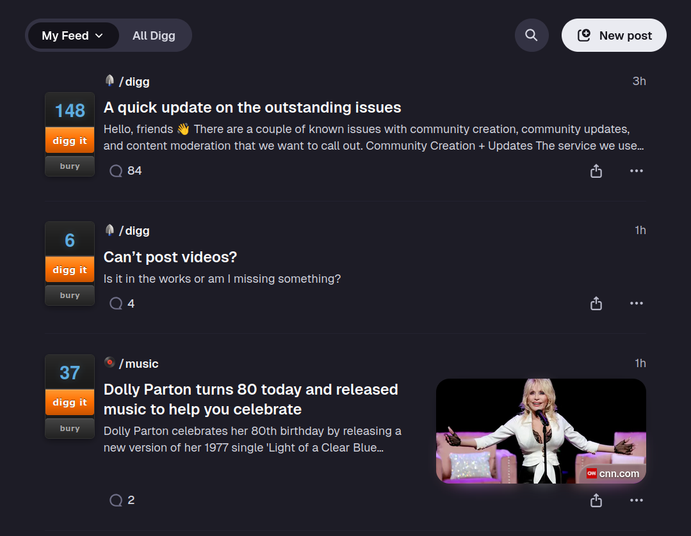
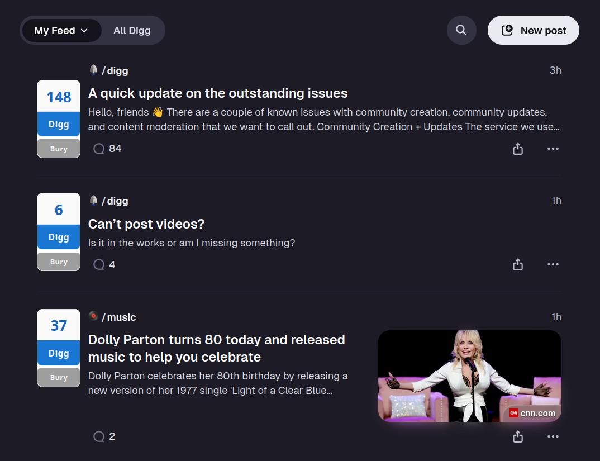
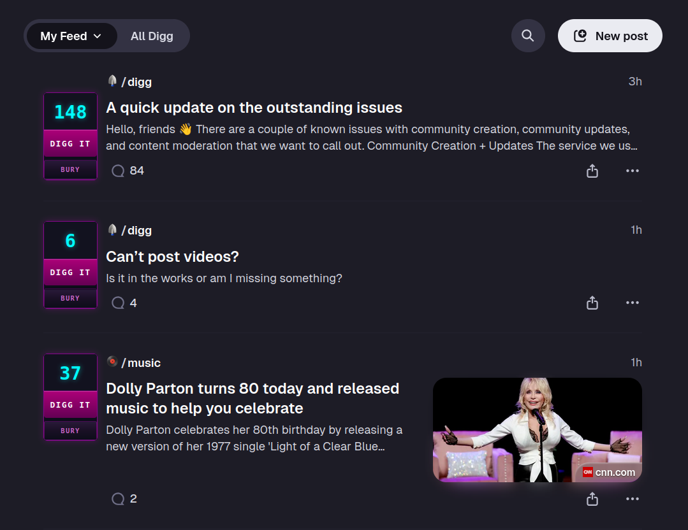
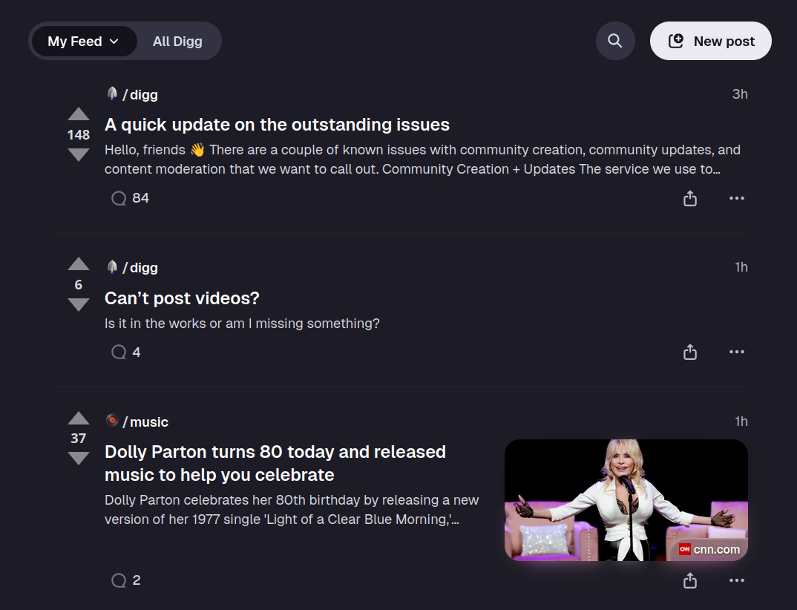

# Digg Button Classic

remember when digg had those orange vote buttons? yeah, I missed them too.

this extension brings back the classic digg button style to the new digg.com. because the current buttons are boring and we deserve better.

## themes

7 built-in themes + custom palettes:

| classic | dark | light |
|---------|------|-------|
|  |  |  |

| cyberpunk | diggit |
|-----------|--------|
|  |  |

- **classic** - the og orange/green digg buttons from like 2008
- **dark** - same vibe but for dark mode users
- **light** - clean minimal look if you're into that
- **cyberpunk** - neon pink and cyan, glowing effects, the whole thing
- **diggit** - reddit-style upvote/downvote arrows (you know the ones)
- **minimal** - keeps default layout, just adds vote state colors
- **chevron** - keeps default layout, replaces arrows with chevrons
- **custom** - create your own color palette (see below)

## install

### firefox
from add-ons store (recommended): search "digg button classic" on addons.mozilla.org

manual: download `.xpi` from [releases](https://github.com/FindWeedNY/digg-button-classic/releases) > about:addons > gear icon > install add-on from file

### chrome
from chrome web store (recommended): search "digg button classic"

manual: download `.zip` from [releases](https://github.com/FindWeedNY/digg-button-classic/releases) > unzip > chrome://extensions > developer mode on > load unpacked > select the folder

### for development
1. clone this repo
2. `./build.sh` to generate both packages
3. firefox: about:debugging > load temporary add-on > select manifest.json
4. chrome: chrome://extensions > load unpacked > select the folder

## usage

click the extension icon, pick a theme. that's it. it saves your choice.

## custom themes

create your own color palette with a simple format - just like slack themes:

```
#upvote,#downvote,#neutral;effects
```

**format:**
- first color = upvote/digg color
- second color = downvote/bury color
- third color = neutral/unvoted color
- after semicolon = effects (optional)

**layout:**
- `classic` - repositioned digg-style buttons on the left with labels
- (default) - minimal, keeps arrows in place

**mode:**
- `dark` - dark mode container/background
- (default) - light mode

**effects:**
- `glow` - adds glow/shadow effect
- `bold` - larger icons
- `outline` - adds outline to voted buttons

**preset palettes to try:**
```
#50fa7b,#ff5555,#6272a4;dark              (dracula)
#a6e22e,#f92672,#75715e;classic,dark      (monokai)
#ff71ce,#01cdfe,#b967ff;dark,glow         (vaporwave)
#238636,#da3633,#8b949e;classic,bold      (github)
#1db954,#b91d47,#535353;dark,outline      (spotify)
#ff9800,#f44336,#5d4037;classic,glow      (ember)
```

copy any palette string and paste it in the custom theme input to use it. share your palettes with friends!

## building

```bash
./build.sh
```

spits out a `.xpi` file ready to distribute.

## privacy

this extension doesn't collect any data. doesn't phone home. doesn't track you. it just makes buttons look different. all your theme preference is stored locally in your browser.

## license

MIT - do whatever you want with it

## links

- [report bugs](https://github.com/FindWeedNY/digg-button-classic/issues)
- [digg.com](https://digg.com) - where this thing actually works

---

made with mass nostalgia for the old digg
